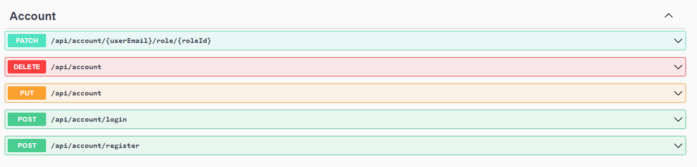
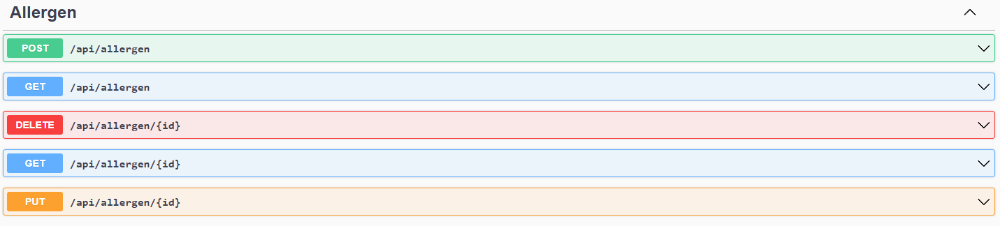

# OrderEat.Api
OrderEat.Api is a api wich can be used to meanage service wchere you can order food from restaurant.

## Table of Contents
* [Technologies Used](#technologies-used)
* [Features](#features)
* [Screenshots](#screenshots)
* [Setup](#setup)
* [Project Status](#project-status)
* [Room for Improvement](#room-for-improvement)
* [Contact](#contact)

## Technologies Used
- .Net - version 7.0
- AspNetCore - version 7.0.3
- AutoMapper - version 12.0.0
- MediatR - version 12.0.1
- EntityFrameworkCore - version 7.0.3
- xunit - version 2.4.2

## Features
List the ready features here:
<!--To do -->

## Screenshots

### Swagger

## Setup
<!--To do -->

## Project Status
Project is: in progress

## Room for Improvement
<!--To do -->

## Contact
Created by [@WojciechLiszka](https://www.linkedin.com/in/wojciech-liszka-576445268/) - feel free to contact me!

