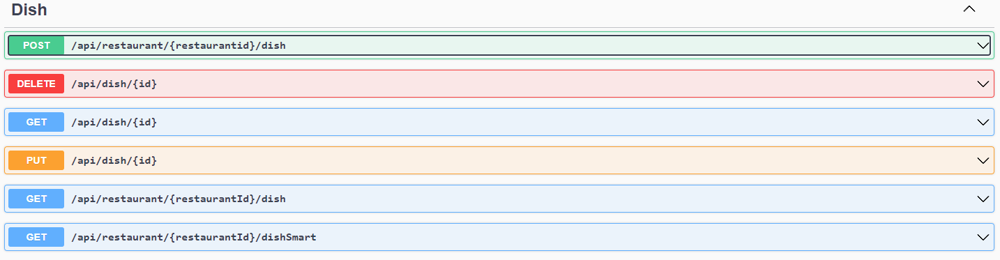
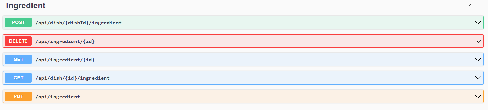
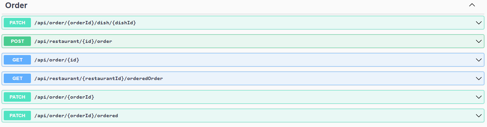
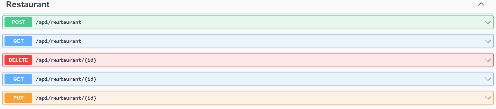
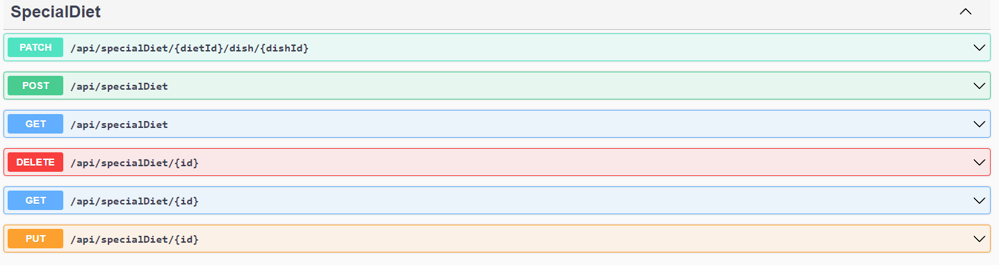

# OrderEat.Api
OrderEat.Api is a api wich can be used to meanage service wchere you can order food from restaurant.

## Table of Contents
* [Technologies Used](#technologies-used)
* [Features](#features)
* [Screenshots](#screenshots)
* [Setup](#setup)
* [Project Status](#project-status)
* [Room for Improvement](#room-for-improvement)
* [Contact](#contact)

## Technologies Used
- .Net - version 7.0
- AspNetCore - version 7.0.3
- AutoMapper - version 12.0.0
- MediatR - version 12.0.1
- EntityFrameworkCore - version 7.0.3
- xunit - version 2.4.2
### Architecture 
-Clean Architecture with CQRS

## Features

### Account Controller
- Register user account
- Login to user account
- Update user details
- Delete user account
- Change user role

### Allergen Controller
- Create Allergen
- Delete Allergen
- Get Allergens from query
- Get Allergen by Id
- Update Allergen

### Dish Controller
- Create Dish
- Delete Dish
- Get Dish by Id
- Get Dishes from restaurant
- Get user personalized dishes from restaurant
- Update dish details

### Ingredient Controller
- Add ingredient to Dish
- Delete ingredient from dish
- Get ingredient by id
- Get dish ingredients
- Update ingredient details

### Order Controller
- Create Order
- Add dish to Order
- Get Order by Id
- Get orders from restaurant which ordered status
- Change order status

### Restaurant Controller
- Create Restaurant
- Delete Restaurant
- Get Restaurant from query
- Get Restaurant by id
- Update restaurant details

### SpecialDiet Controller
- Create Diet
- Delete Diet
- Added Diet to allowed for diet dish property
- Update Diet details

## Screenshots

### Swagger

## Project Status
Project is: Finished

## Contact
Created by [@WojciechLiszka](https://www.linkedin.com/in/wojciech-liszka-576445268/) - feel free to contact me!

